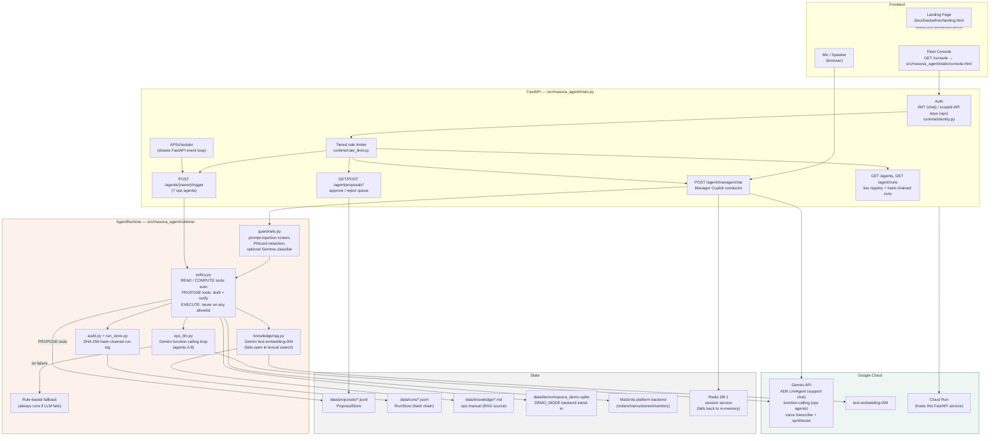

# Architecture

How Gemini connects to the backend, the database, and the frontend for the
**Fortified Enterprise Fleet** submission.

## Component map

| Layer | Component | Role |
|---|---|---|
| **Frontend** | Fleet console (`GET /console`) | Manager UI — `src/masova_agent/static/console.html`. Live registry, traces, hash-chain badge, approve/reject queue. Nothing mocked. |
| | Landing page (`landing.html`) | Static overview / governance-model explainer, no backend calls. |
| **API** | FastAPI (`main.py`) | Single service: chat, ops triggers, proposal review, agent registry, run history. Deployed to **Cloud Run**. |
| | Auth (`runtime/identity.py`) | Customer JWT (HS512) for chat; per-agent scoped API keys (`AGENT_API_KEYS`) for ops triggers and manager endpoints — least-privilege, not one shared secret. |
| | Scheduler | APScheduler jobs (demand forecast, inventory, churn, shifts, kitchen coach, pricing) sharing the FastAPI event loop — no stray `asyncio.run()`. |
| **Runtime** | `runtime/guardrails.py` | Regex/heuristic prompt-injection screen + Luhn-validated card redaction + email redaction on all chat input/output; optional Gemma-model classifier as a second opinion. |
| | `runtime/policy.py` | Enforces the HITL tier per tool: **Read/Compute** auto, **Propose** drafts + notifies a manager, **Execute** does not exist on any agent's allowlist. |
| | `runtime/ops_llm.py` | Gemini function-calling loop for the 7 ops agents — short-lived per-trigger sessions, allowlisted tools only. |
| | `knowledge/rag.py` | RAG over `data/knowledge/` — Gemini `text-embedding-004` when a key is live, fails open to lexical search so the copilot never hard-fails on an embedding outage. |
| | `runtime/audit.py` + `run_store.py` | Every run recorded with agent name, trigger type, store_id, tools used, and a SHA-256 hash chain (`record_hash`/`prev_hash`) over the run log for tamper-evidence. |
| **Google Cloud** | Gemini API | Backs the Manager Copilot (ADK `LlmAgent`), the 7 ops agents' function-calling loops, voice transcribe/synthesize, and RAG embeddings. |
| | Cloud Run | Hosts the FastAPI service — the mandatory Google Cloud infrastructure component for this track. |
| **Data** | `proposal_store` / `run_store` (JSONL) | Durable proposal queue and hash-chained run history — the audit trail a manager reviews. |
| | Demo backend (`services/demo_backend.py` + SQLite) | 24-store demo world standing in for the live MaSoVa platform backend behind `DEMO_MODE=true`, same request/response shape as the real outbound calls. |
| | MaSoVa platform backend | The real system of record (orders, menu, inventory, stores) when not in demo mode. |
| | Redis (DB 1) | Session storage for the ADK support-chat agent; falls back to in-memory if unreachable. |

## Design principles this diagram encodes

1. **Nothing auto-executes.** Every path that reaches a Propose-tier tool ends at `ProposalStore`, not at the backend — a manager resolves it via `POST /agent/proposals/{id}/resolve`.
2. **LLM failure never surfaces as an error.** Every Gemini-dependent path (ops tool loop, RAG embedding, guardrail classifier) has a fallback drawn beside it and fails open to a rule-based or lexical path rather than raising to the user.
3. **Identity is scoped per agent**, not one shared trigger secret — `AGENT_API_KEYS` binds each caller to specific scopes (`trigger:inventory_reorder`, `read:proposals`, etc.).
4. **The run log is tamper-evident**, not just logged — the hash chain in `run_store.py` means a run record can't be silently edited after the fact without breaking the chain.
