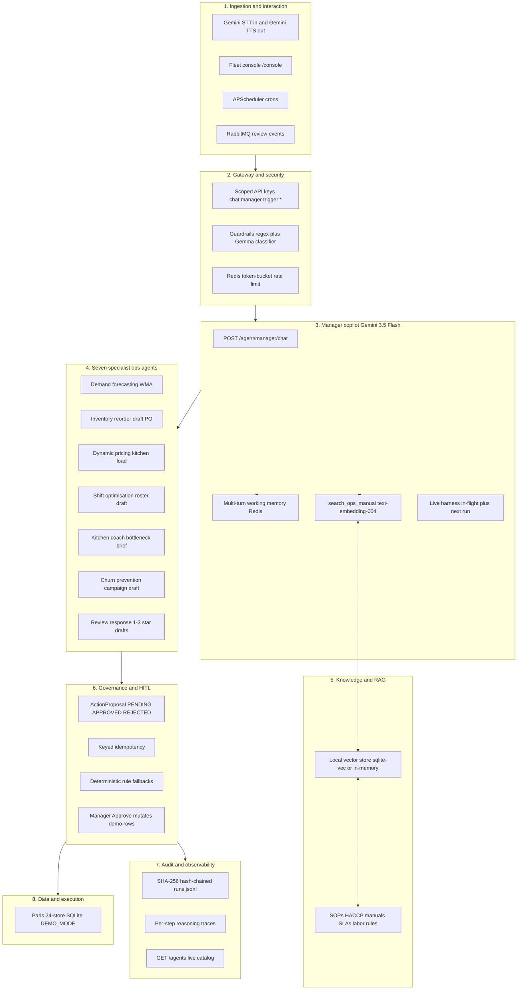

# MaSoVa Enterprise Fleet — Master Architecture & Product Spec

Status: **approved for planning** (2026-08-29).  
Track: All Things Agentic — **The Fortified Enterprise Fleet**.  
This file is the product law for the remaining work. It inherits [hackathon-constraints.md](./2026-08-22-hackathon-constraints.md) and [2026-08-29-manager-gemini-chat-design.md](./2026-08-29-manager-gemini-chat-design.md). If those files disagree with this one on UI, HITL apply, or manager chat, **this file wins**.

**Target persona:** Multi-unit store and regional restaurant operations managers.  
**Domain:** Enterprise B2B restaurant operations fleet (Paris, 24 stores).  
**Core stack:** Python 3.12, Google ADK 1.28+, Google GenAI (Gemini 3.5 Flash), Google Cloud Run, FastAPI, Redis, RabbitMQ, SQLite (`DEMO_MODE`), APScheduler.

---

## 1. System identity and mission

**MaSoVa Enterprise Fleet** is a fortified multi-agent operations platform that places a regional restaurant manager at the helm of **7 autonomous specialist agents** and a **conversational voice/text ops assistant** (MaSoVa AI). It replaces fragmented restaurant software with an audited, human-in-the-loop operating system for inventory, demand forecasting, dynamic pricing, kitchen bottlenecks, staffing schedules, customer churn, and review triage.

The **live agent harness** in `/console` is the control plane judges and managers see. Gemini Chat is the mouth. Store proof is the ledger. Approve is the commit.

Not a diner bot. Not a second voice stack. Not a Dell LAN demo. Public story is **100% Gemini + Google ADK**.

---

## 2. Users, pain, success, launch

| | |
|---|---|
| **User** | Regional manager of 24 Paris pizza stores (hero: 11e Oberkampf, store_id `68a1f2c9e4b0a1234567890a`, code `DOM011`). |
| **Pain** | Eight ops jobs without silently writing the business. |
| **Success** | Open `/console`, see the harness alive, trigger any specialist, see tool-grounded numbers, Approve, prove the row changed. |
| **Launch** | Cloud Run URL + 4-min video with GCP proof + README that matches the running app. Deadline **Mon 31 Aug 2026, 17:00 PDT**. |

---

## 3. HITL policy (non-negotiable)

**Two-phase commit.** The point of the agents is to make operational changes **after** a human commits.

| Phase | Rule |
|---|---|
| Agent alone | READ / COMPUTE / PROPOSE only. May insert a **DRAFT**. Never EXECUTE. |
| Manager Approve | **Apply the payload** to demo SQLite. The store changes. That is the product. |
| Manager Reject | Draft cancelled. Nothing advances. |

**Blocked on the agent (forever, even after this work):** `patch_menu_price`, `execute_purchase_order`, `execute_refund`, `cancel_order_immediate`, `send_campaign_live`, `confirm_shifts`.

**On Approve in `DEMO_MODE`:**

| Proposal type | Apply |
|---|---|
| `DRAFT_PURCHASE_ORDER` | PO → `PENDING_APPROVAL` |
| `DRAFT_CHURN_CAMPAIGN` | Campaign → `SCHEDULED` |
| `DRAFT_SHIFT_ROSTER` | Shifts → `CONFIRMED` |
| `SUGGEST_PRICE_ADJUSTMENT` | Update `menu_items.price` for `payload.item_ids` by `payload.percent` and `payload.direction` (`increase` or `discount`). Caps already on the proposal: increase ≤ 12%, discount ≤ 15%. Set `patches_menu` true only after this apply. Reject never touches price. |
| `WRITE_FORECAST` | Insert a row in demo table `manager_actions` (type `WRITE_FORECAST`, status `APPLIED`, payload JSON). |
| `DRAFT_REVIEW_REPLY` | Same table, type `DRAFT_REVIEW_REPLY`. |
| `DRAFT_KITCHEN_BRIEF` | Same table, type `DRAFT_KITCHEN_BRIEF`. |

**Still never, even on Approve:** unbounded prices, card-network refunds, real supplier APIs, blasting every guest from this service. Demo SQLite is the world we own.

Diner `POST /agent/chat` remains a hidden API. It is not in README, console, or video.

---

## 4. Ten-layer architecture: keep, finish, add

| Layer | Already built | Must finish in this work | Industry target kept as later (not this plan) |
|---|---|---|---|
| 1 Ingestion | Mic transcribe, `/console`, APScheduler, RabbitMQ `review.created` | Rail click = run; **Gemini TTS on replies**; live harness | Gemini Live duplex; Celery / Temporal; old masova-voice; Web Speech TTS |
| 2 Security | Scoped keys, regex + Gemma hook, output leak screen | Redis token-bucket per key/store; Gemma documented on for Cloud Run | Org RBAC (Director vs GM vs Shift Lead) |
| 3 Control plane | Copilot exists; inventory + pricing tools | **All 7 specialists in chat**; live harness; **`manager_chat` in GET /agents**; `compare_store_performance` | Heavy multi-agent DAGs |
| 4 Intelligence | 20+ tools, zero LLM math, rule fallbacks | LLM circuit breaker on consecutive failures; honor `OPS_LLM_TIMEOUT_SEC` | — |
| 5 Knowledge / RAG | None | **Corpus + embeddings + `search_ops_manual`** | Vertex Search / AlloyDB |
| 6 Memory | Support chat Redis; manager chat one-shot | **Multi-turn manager memory** | Long-term manager preference profiles |
| 7 HITL | Proposal store, idempotency, expiry | **In-chat list/approve/reject**; price apply | Compensation workflows to vendors |
| 8 Observability | Hash chain, traces, registry, in-process metrics | In-flight runs; **mid-run tool upserts**; **SHA-256 badge in /console** | Full OpenTelemetry SaaS |
| 9 Data | Paris SQLite, inventory apply | Apply remaining types; proof tables for campaigns/shifts | Hosted MaSoVa Spring |
| 10 Deploy | Dockerfile, healthcheck, seed script | Cloud Run `--max-instances=1`, Secret Manager, seed-on-boot | Multi-region |

---

## 5. Manager copilot

**Door:** `POST /agent/manager/chat`  
Auth: `X-Agent-Api-Key` scope `chat:manager`.  
Body: `{ message?, sessionId?, storeId?, audioBase64?, mimeType? }`.

**Tools (complete set):**

READ / COMPUTE already on the copilot, plus:

- `run_inventory_reorder`
- `run_dynamic_pricing`
- `run_demand_forecast`
- `run_churn_prevention`
- `run_shift_optimisation`
- `run_kitchen_coach`
- `run_review_response` (requires review payload or latest low-rating review for the store)
- `search_ops_manual`
- `list_pending_proposals`
- `approve_proposal`
- `reject_proposal`
- `compare_store_performance` (focus store vs fleet band; numbers from tools only)

Every specialist `run_*` accepts `store_id` (defaults to focus store in demo). HTTP triggers accept `{ storeId }` the same way. Unknown `storeId` scopes to that id only — never silent fleet fallthrough.

**Memory:** last 10 turns for `sessionId` from Redis (`masova:session:{id}`), else in-memory. Passed into the Gemini `contents` list. Fail open if Redis is down.

**Voice (MaSoVa Voice — Gemini both directions):**

1. **In:** Mic → Gemini audio understanding → transcript → same manager loop (already in code).
2. **Out:** After the text reply is ready, Gemini TTS synthesizes it (`GEMINI_TTS_MODEL`, same `LLM_API_KEY`). `POST /agent/manager/chat` returns `{ reply, audioBase64?, mimeType? }`. Console plays that audio with `Audio()`. Typed and spoken turns both get Gemini audio out. If TTS fails, return text anyway (fail open). CI mocks TTS; never calls the network.
3. Not Gemini Live duplex. Not browser `speechSynthesis`. Not the old `masova-voice` Voicebox/n8n stack.

Old `SVamseekar/masova-voice` stays out of this repo.

---

## 6. Live harness (key surface)

The left rail **is** the fleet. No accordion required to see state.

Per specialist, always, from APIs never invented:

1. **Mission** — authored label.
2. **Watching** — schedule + `next_run_time` + last grounded read.
3. **Now / recent** — in-flight current tool, else last tool-grounded line.
4. **Evidence** — PENDING count or last approve.

**Runtime truth:**

- `AgentRuntime.run` writes `status=running` with `run_id` **before** the LLM/fallback. Sets `request.run_id` so the tool loop can upsert.
- **LLM / scripted tool loop:** `ops_llm` calls `run_store.upsert_run` after **each** tool (in-memory / last-write; **does not** append a hash-chain JSONL line).
- **Rule fallback:** start stub + terminal chained record only (no per-SQL-step upsert unless that path is later refactored onto tools).
- Final `audit.log_run` → `record_run` is the **only** hash-chain append. The header badge counts those terminal rows (`chain_length`, `chain_tip`), not in-flight upserts.
- Single Cloud Run worker is async: `GET /agent/runs/{id}` and `GET /agent/watch` **must** succeed while `POST` trigger is still awaiting. Console may `await fetch(trigger)` — the event loop yields; harness `setInterval` still fires.
- `GET /agents` includes `next_run_time`, `in_flight`, `last_run`, and a **`manager_chat` conductor** row (Regional Manager Copilot) with its tool allowlist. `support_chat` may remain in the catalog as a hidden API but **must not** appear on the `/console` rail.
- Console rail = **conductor + 7 specialists** only.
- Console polls every 2–3s: `/agents`, `/agent/runs?storeId=`, `/agent/proposals?status=PENDING&storeId=`.
- Thread live-run timeline uses the **same** `run_id`. Mid-run, `ops_llm` calls `run_store.upsert_run` after **each** tool so `/agent/runs/{id}` grows a waterfall while the agent is still working.
- **Watch pulse and SHA-256 header badge** stay in the spec as **demo/packaging**, not the first build. Implement after all specialists, HITL apply, memory, RAG, and Gemini voice in/out are green. Watch: `GET /agent/watch?storeId=` (scope `read:runs`) `{ storeId, active_orders, kitchen_queue, pending_proposals, at }`, `DEMO_WATCH_SEC` default 20, `data-watch-sec` on `<body>`. Badge: `chain_verified` / `chain_length` / `chain_tip` on `GET /agent/runs`. **No invented stations, no Open-Meteo canvas.**

Click a rail specialist → `POST` that agent’s trigger with `{ storeId: FOCUS_STORE_ID }`. Click the conductor → focus the composer. Composer / mic may invoke the same agents.

Attach stays local filenames. Role menu stays cosmetic.

---

## 7. Knowledge and RAG

**Corpus** (Markdown, checked in under `data/knowledge/`):

- `food_safety_haccp.md`
- `equipment_troubleshooting.md`
- `labor_compliance_eu.md`
- `supplier_slas.md`

Paris / EU restaurant ops only. No invented kg/L of live inventory in these files.

**Engine:** `src/masova_agent/knowledge/rag.py`

- Chunk markdown (~500 tokens, 80 overlap).
- Embed with Gemini `text-embedding-004` when `LLM_API_KEY` is set.
- Persist vectors in SQLite table `ops_manual_chunks` (or in-memory list in tests).
- `search_ops_manual(query, category="")` → `{ ok, hits: [{ title, section, text, score }] }`.
- **CI / no key:** lexical fallback (token overlap) so tests never call the network.
- Tool is READ-tier. Never a substitute for `list_low_stock` numbers.

---

## 8. Production standards in this slice

| Standard | Spec |
|---|---|
| Auth | Scoped `AGENT_API_KEYS`; console injects manager key in demo |
| Rate limit | Redis token bucket, 60 req/min per key default (`RATE_LIMIT_PER_MIN`); fail open if Redis down; skip `/health` |
| LLM circuit | After 3 consecutive `llm_failed` for an agent, skip LLM for 60s and use rule fallback |
| Timeouts | `OPS_LLM_TIMEOUT_SEC` enforced on generate_content |
| Idempotency | Existing keys; Redis write mirror already there |
| Guardrails | Regex always. **Gemma stays:** optional second pass already in `runtime/guardrails.py` when `GEMMA_MODEL` is set; fail open; CI unset. Do not rebuild Gemma. Turn it on at Cloud Run for the +0.2 bonus. |
| Errors | Never raw provider errors to the manager |
| Logs | `agent_audit` JSON; no secrets/PII |
| Health | `GET /health` |
| Single instance | Cloud Run `--max-instances=1` because SQLite |
| Seed on boot | If `DEMO_MODE` and DB missing, run `scripts/seed_demo_data.py` |
| Env | `GEMINI_TTS_MODEL`, `RATE_LIMIT_PER_MIN`, `GEMMA_MODEL`, `OPS_LLM_TIMEOUT_SEC`, `DEMO_WATCH_SEC` (demo phase) in `config/env.example` |
| Secrets (Cloud Run) | `LLM_API_KEY`, `JWT_SECRET`, `AGENT_API_KEYS` or `AGENT_TRIGGER_API_KEY`, `AGENT_TOKEN` |
| Public story | Gemini / Google ADK only |
| Allowlist invariant | `AGENT_ALLOWLISTS["manager_chat"]` == `MANAGER_TOOLS` (same names, including RAG and proposal tools) |

**Out of this implementation:** Gemini Live duplex, Celery/Temporal, org RBAC, Grafana/OTel SaaS, IoT mesh, hosting Spring MaSoVa, browser `speechSynthesis`, old masova-voice.

**Build order:** (1) specialists + HITL + memory + RAG + Gemini voice in/out + runtime robustness, (2) console harness to operate them, (3) demo packaging (watch pulse, chain badge, Devpost diagram, write-up). Do not block (1) on (3).

---

## 9. Tests (eval-driven)

Golden cases **before** claiming a layer done:

1. In-flight: a run is `GET /agent/runs/{id}` with `status=running` before completion (inject a slow fallback).
2. Inventory closed loop: trigger → PENDING → Approve → PO `PENDING_APPROVAL`.
3. Pricing closed loop: Approve writes capped menu price; reject does not.
4. Churn / shifts apply on Approve.
5. Manager chat tools include all 7 `run_*` plus RAG plus proposal tools.
6. `approve_proposal` tool applies the same as HTTP resolve.
7. Manager memory: second turn sees first turn (in-memory path).
8. `search_ops_manual("cooler temperature")` hits HACCP chunk (lexical in CI).
9. Rate limit returns 429 after N+1 (fake clock / low limit).
10. Circuit breaker skips LLM after 3 failures.
11. Console HTML: harness poll, rail click handlers, no canned kg strings.
12. Gemma unset: CI still passes; Gemma set + fake YES → block.
13. Scripted tool loop: `GET /agent/runs/{id}` shows 2+ `reasoning_trace` steps while a slow second tool is still running.
14. `GET /agents` includes `manager_chat` with category `conductor` and endpoint `/agent/manager/chat`.
15. `run_manager_chat` (mocked TTS) includes `audioBase64` when the TTS stub returns bytes; on TTS exception still returns `reply`. Console plays `Audio` from `audioBase64`, not `speechSynthesis`.
15b. (Demo phase) `GET /agent/watch?storeId=` returns integer counts; console has watch timer and `chain_verified` badge.
16. Console HTML has no Support Chat as a live rail item after registry paint (no `data-agent-id="support_chat"` left in `#rail-team` after `renderAgentRailItem`).

Existing suite (~354) must stay green.

---

## 10. Hackathon invariants

1. **Gemini 3.5 Flash** via `google-genai` + **Google ADK**.
2. **Cloud Run** `DEMO_MODE=true`, `--max-instances=1`.
3. Public narrative never names a non-Google iteration provider.
4. Zero LAN (`192.168.50.88`) in source defaults, README, or e2e for the submission.
5. Bonus (operator, not code): Gemma classifier (`GEMMA_MODEL` on Cloud Run); a public write-up that names the hackathon; a social post with `#AllThingsAgenticHackathon`. Tracked as plan Task 12C.

**5-beat video:**

1. Before — store proof mozzarella / tomato from tables API.
2. Voice or type — “Check inventory for Oberkampf and restock.”
3. Harness — Inventory **Running · list_low_stock**; thread shows the same tools.
4. Approve (click or “Approve that PO”).
5. After — PO status changed; hash chain updated; **capped price path shown on a second beat** if pricing is the second agent (price **does** write on Approve in demo).

---

## 11. Product methodology (this repo)

Mapped to the user’s process, AI-native:

| Phase | This spec |
|---|---|
| 1 Problem and autonomy | Manager ops; agents Propose only |
| 2 Brief and HITL | This file |
| 3 Dual architecture | SQLite ops + RAG corpus; token/time budgets already env |
| 4 Eval-driven | Golden cases in §9 |
| 5 Foundation slice | Inventory loop already exists; harness makes it live |
| 6 RAG and specialist skills | §5–§7 |
| 7 Guardrails | Regex + Gemma |
| 8 Dual-track verify | pytest + eval harness |
| 9 Audit and docs | Ledger + README + CAPABILITY_MAP match code |
| 10 Production | Cloud Run + rate limit + circuit |

---

## 12. Docs subtraction

- `docs/AGENT_PLATFORM.md` remains the architecture doc; update manager chat + harness + RAG.
- `docs/CAPABILITY_MAP.md` gains manager tools and RAG.
- README hero = manager harness, not diner chat.
- Archive or delete stale `docs/ARCHITECTURE.md` and Java `docs/PROJECT_PHASES.md` (wrong product).
- Delete unused mock path: `src/masova_agent/data/models.py`, `data/repositories.py`, `services/customer_service.py`, `services/order_service.py`, `services/location_service.py`, `tools/system_briefing.py`, and tests that import them. Keep `demo_backend.py`.
- Scheduler comments: Paris local / `SCHEDULER_TZ` (default Europe/Paris), not IST.
- Dockerfile **COPY `data/knowledge/`**. Lifespan already seeds SQLite if missing — verify that still works in the image.
- Devpost architecture diagram: `docs/hackathon/architecture-diagram.html` (and a PNG capture) matching Picture 2: console → Cloud Run / Gemini 3.5 / ADK / 7 specialists + copilot → SQLite.
- `scripts/test-e2e.sh` targets localhost `DEMO_MODE`, not the lab IP.

---

## 13. Exit criteria

- Cloud Run `/console` completes inventory before/after without a lab VPN.
- Rail shows **conductor + 7 specialists** (no Support Chat). `GET /agents` includes `manager_chat`.
- Harness shows **Running** with a real tool name **during** a run; `/agent/runs/{id}` gains steps before the HTTP trigger returns.
- Watch pulse moves a real order/kitchen count within `DEMO_WATCH_SEC` without minting a proposal.
- Header shows a **verified SHA-256** chain pill (or a red break).
- Manager chat returns Gemini TTS `audioBase64`; console plays it (typed and mic). Fail open to text.
- Manager can approve by click **or** chat.
- RAG answers an SOP question without inventing stock numbers.
- README, this spec, architecture diagram, and the running app tell the same story.
- `pytest tests/ -q` green.

---

## 14. Spec self-review (2026-08-29, second pass)

Checked against: this conversation, the master blueprint, the seven Grok additions, existing tests that will break (`test_registry` length 8, `ENDPOINT_MAP` POST pin, `test_equal_agent_quality` name list, `test_regression` mock repos).

**Pinned so implementers cannot fork:**

- Price apply uses `payload.item_ids` + `percent` + `direction`. Caps 12% / 15% already on the tool.
- Forecast / review / kitchen apply → one new demo table `manager_actions`.
- `DEMO_WATCH_SEC` injected as `data-watch-sec`.
- Hash badge = terminal JSONL chain, not in-flight upserts.
- Static HTML rail must not ship Support Chat as the painted default; JS skip is not enough if paint fails.
- `OPS_LLM_TIMEOUT_SEC` wraps `generate_content` (Task 9), not only an env comment.

**Gemma:** keep the existing classifier. No new Gemma work besides env on deploy.

**Still later (named):** Gemini Live, Celery, org RBAC, Grafana, OTel SaaS, old masova-voice, Playwright, Redis idempotency *read*, shared menu `store_id`, dual `httpx` in rule agents, demo watch/badge/diagram until agents are done.
